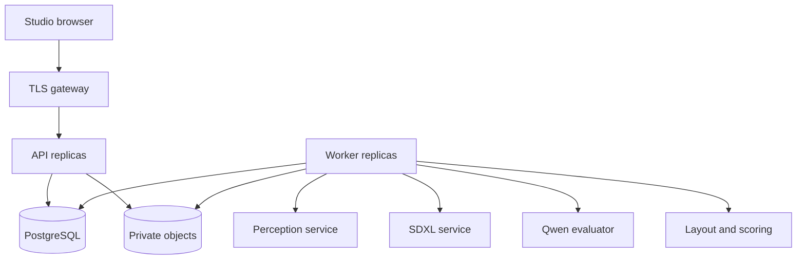

# Architecture

The control plane is CPU-only and stateless apart from PostgreSQL and private
object storage. Workers orchestrate long operations outside web requests. Model
services have independent scaling and dependencies. A browser never receives
model keys, storage credentials, or a directly usable private object key.

## State and reliability

`Tenant` scopes users, projects, uploads, jobs, and feedback. Sessions contain
hashed opaque tokens. The project revision is optimistic concurrency control.
An enqueue transaction locks the tenant and project, checks limits, and writes
the entire job input snapshot. `Idempotency-Key` is unique per tenant and bound
to project, kind and revision. Reusing a key with different inputs returns 409.
Project edits/uploads are rejected while its job is active.

PostgreSQL workers claim jobs with `FOR UPDATE SKIP LOCKED`; no external broker
or fragile database/broker dual write is required. Database time establishes
leases. Every heartbeat, checkpoint and completion is fenced by an unexpired
random lease token. A terminated worker's job can be reclaimed. Retry attempts
are bounded and transient failures have delayed availability. Cancellation
invalidates the lease, preventing a late worker from publishing a result.

Stages commit checkpoints only after their artifacts are saved. Artifact keys
include tenant, project, job and attempt token, so a stale worker cannot overwrite
a new attempt's files. Operations are at-least-once; database publication is
fenced. Cancellation cannot instantly abort a GPU kernel already running. A
reclaimed attempt may repeat an uncheckpointed inference call.

Rolling model changes must drain the queue first. Results record model revisions;
an evaluator revision mismatch rejects the old job. Use an immutable model lock
and unchanged model service deployment for all stages of a release. There is no
distributed transaction spanning a GPU service and PostgreSQL.

## Photo pipeline

The ingress decoder strips EXIF and normalizes orientation/resolution. Qwen
produces a validated observation record. Grounding DINO detects furniture/floor
and structural openings; SAM 2.1 segments box prompts. Opening masks are removed
from the automatic editable union. Depth Anything V2 produces relative inverse
depth, never calibrated metres.

Users provide metric geometry. A learned layout model can propose positions, but
the bounded beam solver enforces piece identity, dimensions, room containment,
clearance, keepouts and optional access connectivity. Without checkpoint weights
the solver operates directly using deterministic layout heuristics.

SDXL uses canny + depth controls for masked photo inpainting. Existing furniture
edges inside the editable mask are removed; relative depth there is inpainted
to avoid strongly preserving old furniture shapes. The final output composites
the sanitized original outside the binary edit mask exactly. This preservation
does not establish a correct camera-to-floor homography or pixel/plan identity.

Qwen scores style, image quality, requirement match and structural consistency.
SigLIP 2 adds image/text similarity. A trained preference model or explicit
weighted scorer orders feasible variants. These are subjective ranking signals,
not probabilities or construction/compliance certificates.

## Floor plans

PDFs are rasterized in a subprocess with CPU, memory, page and pixel limits.
The floor-plan adapter can use the separately supplied, hash-checked CubiCasa
research checkpoint or the independent licensed-data `FurnitureFloorplanNet`.
Dense predictions are pixel regions. Neither adapter silently converts pixel
length into metres. Users confirm the selected room boundary and dimensions.
The measured furniture plan becomes a canny control for a top-down SDXL concept.
Single-room layout is implemented; automatic multi-room building reconstruction
and perspective camera synthesis from floor plans are outside this release.

## HTTP surface

| Route | Behavior |
|---|---|
| `POST /api/auth/login`, `/logout` | Opaque cookie sessions; exact Origin validation on mutations |
| `GET /api/me` | Current workspace account and enabled model modes |
| `GET/POST /api/projects` | Paginated project list and creation |
| `GET/PATCH/DELETE /api/projects/{id}` | Scoped retrieval, revision-controlled edits, tombstone deletion |
| `POST /api/projects/{id}/assets?kind=photo|floor_plan|mask&page=0` | Multipart upload and decoding |
| `GET /api/assets/{id}` | Authenticated image streaming through API |
| `POST /api/projects/{id}/jobs` | `{"kind":"analyze"}` or `{"kind":"design"}` plus Idempotency-Key |
| `GET /api/jobs/{id}`, `POST .../cancel` | Job status and cancellation |
| `GET /api/jobs/{id}/artifacts/{name}` | Authorized finished artifacts |
| `GET /api/jobs/{id}/export?format=json|csv` | Measured plan and result export |
| `POST /api/jobs/{id}/feedback` | Winner/loser proposal indices; training consent defaults false |
| `/health/live`, `/health/ready`, `/metrics` | Liveness, migration readiness, protected queue metrics |

Development OpenAPI is available at `/api/docs`. It is disabled in production.
The CLI is the account administration boundary; there is no unauthenticated
registration, exposed password reset endpoint, or client-controlled role field.

## Deferred supplier boundary

Keep concepts independent of offers. The later catalog phase needs normalized
product dimensions, supplier identifiers, regional availability, offer timestamps,
currency, stock and permitted product-image usage. Retrieval should shortlist
dimension-compatible products before style reranking and refresh offers before
showing purchase links. That integration is deliberately not represented by fake
catalog responses in this codebase.
